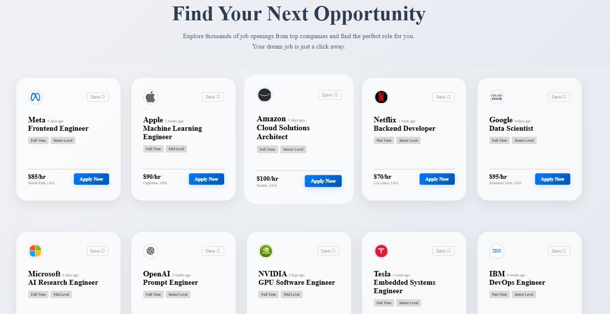

# Modern Job Portal UI

A visually appealing and responsive user interface for a job listings portal, built with React and Vite. This project features a clean, modern design with a "glassmorphism" aesthetic, subtle animations, and a professional layout.



---

## Features

-   **Modern "Glassmorphism" Design:** Clean and stylish cards with a frosted glass effect.
-   **Interactive Hover Effects:** Smooth animations on job cards and buttons for an engaging user experience.
-   **Professional Layout:** A clear and intuitive layout with a prominent header and a well-organized grid of job listings.
-   **Responsive:** Designed to look great on various screen sizes, from mobile devices to desktops.
-   **Built with Modern Tools:** Leverages the speed and efficiency of React and the Vite build tool.

---

## Tech Stack

-   **Frontend:** React
-   **Build Tool:** Vite
-   **Styling:** CSS3

---

## Getting Started

Follow these instructions to get a copy of the project up and running on your local machine for development and testing purposes.

### Prerequisites

You need to have [Node.js](https://nodejs.org/) and [npm](https://www.npmjs.com/) installed on your computer.

### Installation

1.  **Clone the repository:**
    ```sh
    git clone https://github.com/your-username/your-repo-name.git