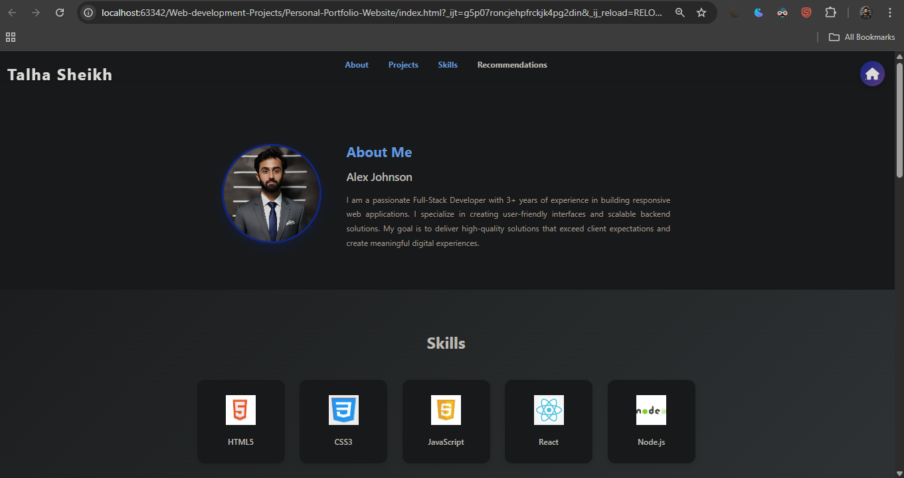

# Personal Portfolio Website

A clean, responsive personal portfolio website to showcase your profile, skills, projects, and contact information. This project is built with vanilla HTML, CSS, and JavaScript, making it easy to customize and deploy anywhere.

## Preview



## Features

- Responsive layout for desktop and mobile
- Hero/intro section with your name and role
- About section with bio and profile image
- Skills section with simple indicators or badges
- Projects/Work section to highlight your best work
- Contact/CTA section with links and social profiles
- Smooth scrolling and basic JS interactivity

## Tech Stack

- HTML5
- CSS3
- JavaScript (vanilla)

## Project Structure

```
Personal-Portfolio-Website/
├─ images/
│  └─ photo.png            # Your profile or preview image
├─ index.html              # Main HTML document
├─ style.css               # Styles
└─ script.js               # Interactivity
```

## Getting Started

You can run this project locally without any build tools.

- Option 1: Open directly
  1. Download/clone the repository.
  2. Open `Personal-Portfolio-Website/index.html` in your browser.

- Option 2: Use a lightweight dev server (recommended for live reload)
  - VS Code + Live Server extension: Right-click `index.html` → "Open with Live Server".

## Customization

- Content: Edit sections inside `index.html` (name, role, about text, projects, links).
- Styles: Adjust colors, fonts, spacing in `style.css`. Consider adding CSS variables at the top for quick theming.
- Images: Replace `images/photo.png` with your own image. Update image paths in `index.html` if you rename files.
- Links: Update social/profile links and email in `index.html` (and `script.js` if any behavior depends on them).

## Deployment

- GitHub Pages
  1. Push this folder to a GitHub repo.
  2. In the repo settings, enable GitHub Pages with source set to `main` (root).
  3. Your site will be available at `https://<username>.github.io/<repo>/`.

- Netlify / Vercel
  - Drag-and-drop the folder onto Netlify, or import the repo into Netlify/Vercel. Since this is a static site, no special build step is required.

## Roadmap Ideas

- Improve accessibility (ARIA labels, contrast, keyboard navigation)
- Dark mode toggle
- Project filters/tags and search
- Contact form with a serverless function (Netlify Forms or a backend)
- Animations on scroll (AOS) or CSS transitions

## License

Add your preferred license here (e.g., MIT). If you intend this to be open-source, include a LICENSE file in the project root.

## Acknowledgments

- Icons, fonts, or illustrations you use (if any)
- Inspiration and references
