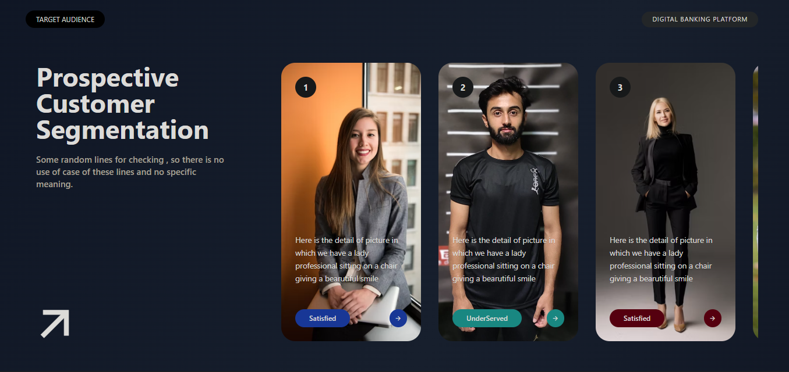

# UI Design Project

A single-section, modern UI hero built with React and Tailwind CSS. It features an animated gradient background, a left content area for headline/CTA, and a horizontally scrollable, snap-aligned card rail on the right. Cards show a large image with an overlay, an index badge, descriptive text, and color-coded action buttons.


## Preview



If the image doesn’t display on your platform, open the file directly at `UI-Design-Project/public/preview.svg`.


## Features

- Animated gradient background for a polished, professional look (with reduced-motion support)
- Horizontally scrollable card rail with smooth scrolling and snapping
- Image overlay for improved text readability
- Per-card color accent via the `color` field in the data model
- Accessible defaults and sensible fallbacks for missing data


## Tech stack

- React (Vite or CRA compatible structure)
- Tailwind CSS


## Getting started

1. Install dependencies
   - Using npm:
     - `cd UI-Design-Project`
     - `npm install`
   - Or using yarn:
     - `cd UI-Design-Project`
     - `yarn`

2. Run the dev server
   - npm: `npm run dev` (or `npm start` if using CRA)
   - yarn: `yarn dev`

3. Open in your browser
   - Navigate to the local address shown in your terminal, commonly `http://localhost:5173` (Vite) or `http://localhost:3000` (CRA).


## Project structure (key files)

- `src/App.jsx` — Provides the `users` array and renders Section 1
- `src/Components/Section1/Section1.jsx` — Section container with animated background
- `src/Components/Section1/page1Content.jsx` — Layout of left and right content
- `src/Components/Section1/LeftContent.jsx` — The left side (headline/CTA)
- `src/Components/Section1/RightContent.jsx` — Horizontal scroll area that maps users to cards
- `src/Components/Section1/RightCard.jsx` — Individual card wrapper and image overlay
- `src/Components/Section1/RightCardContent.jsx` — Card text, index badge, and color-tag buttons
- `src/index.css` — Tailwind import and custom CSS (animated background, scrollbars)
- `public/preview.svg` — Visual preview image used in this README


## Data model

Cards are driven by an array of user-like objects passed to `Section1`. Each object can include:

```
{
  img: string,   // image URL shown on the card
  intro: string, // optional short description; defaults to a sample text
  color: string, // optional CSS color value used for buttons (e.g., 'royalblue' or '#f59e0b')
  tag: string    // short label for the primary action button
}
```

Defaults exist for missing values so the UI remains stable even with partial data.


## Customization tips

- Background animation speed: adjust the `animation` duration in `.bg-animated` within `src/index.css`.
- Card snapping/scroll behavior: tune classes in `RightContent.jsx` (e.g., `scroll-smooth`, `snap-x`, `snap-mandatory`).
- Card hover feel: update transition and shadow classes in `RightCard.jsx`.
- Per-card color: set `color` on each item in `users` inside `src/App.jsx`.


## Accessibility

- Honors `prefers-reduced-motion` to disable background animation for motion-sensitive users.
- Ensures the numeric index inside the white badge remains visible by using dark text.


## Screenshot guidance

The included `public/preview.svg` provides a visual snapshot of the layout. If you prefer an actual runtime screenshot:

1. Run the dev server.
2. Open the app in your browser.
3. Take a screenshot of the hero section.
4. Save it as `public/screenshot.png` and update the image link in this README if desired.


## License

This project is provided as-is for learning and demonstration purposes. Unsplash images are used under their respective licenses via hotlinks in the demo data.
